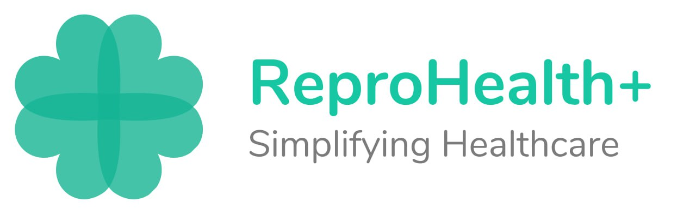
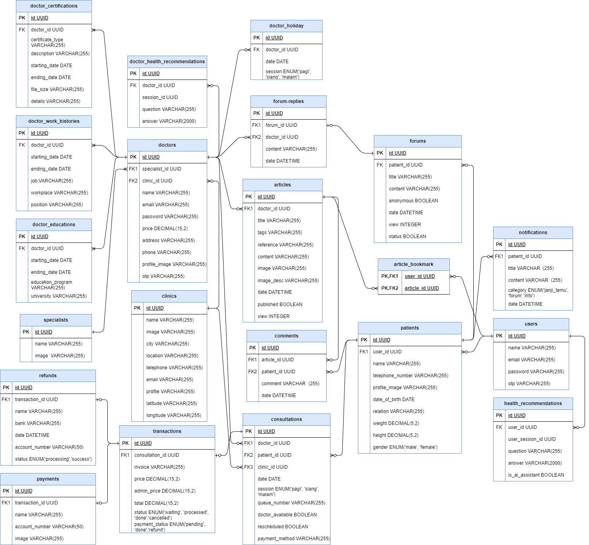

Capstone Project Kampus Merdeka Batch 5 Alterra Academy Kelompok 1 dengan topik "Reproduction Health"

 

## API DOCUMENTATION
---

- We use Postman for API Documentation
- Link to API Documentation: <a href="https://documenter.getpostman.com/view/26802405/2s9YeEbrs2" style="text-decoration:underline">Here</a>
- Paste this link to your browser if you can't open the link: https://documenter.getpostman.com/view/26802405/2s9YeEbrs2

 

## Entity Relationship Diagram
---
- We use draw.io to design our ERD, below is our ERD Design:
  

 

## Other Links
---
| Description             | Links                                                           |
| ------------------------| ----------------------------------------------------------------|
| Our Github Organization | https://github.com/team-capstone-1                  |
| Github                  | https://github.com/team-capstone-1/be-repro-health  |
| Trello                  | https://trello.com/b/rIoiovwV/golang-section        |
| Deployment to GCP       | https://reproduction-health-c2u5s4z6yq-uc.a.run.app |
| Pointing Domain         | api.reprohealth.my.id                               |

 

## Back-End Team
---
| Name                 | Role                   | Home Town | University                           |
| ---------------------| -----------------------|-----------|--------------------------------------|
| Septiandi Nugraha    | Lead Back-End Golang   | Cirebon   | Institut Teknologi Telkom Purwokerto |
| Davin Aristia Onggo  | Back-End Golang Member | Medan     | Universitas Mikroskil                |
| Rizki Andika Setiadi | Back-End Golang Member | Jakarta   | Universitas Gunadarma Depok          |